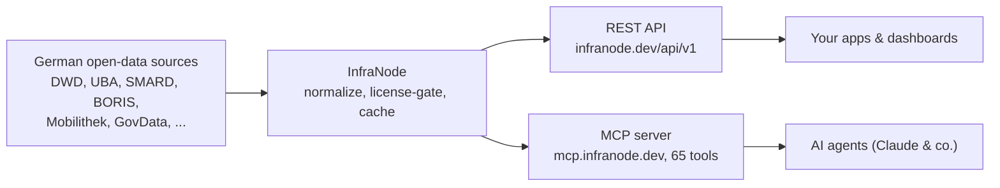

# InfraNode

[](https://github.com/street1983nk/infranode/stargazers)
[](./LICENSE)
[](https://glama.ai/mcp/servers/street1983nk/infranode)
[](https://registry.modelcontextprotocol.io)
[](https://smithery.ai/server/infranode/infranode)

**The open-data REST API for Germany: a keyless HTTP API for German
public-infrastructure open data, also available as an MCP server.**

German cities publish a lot of open data, but every source has its own format,
fields and quirks, and several need portal registration. InfraNode normalizes
~20 categories, weather (DWD), air quality (UBA), public transit (incl. realtime
departures), traffic, electricity price (SMARD), land values (BORIS), parking,
charging, water levels, demographics, energy and more, for **84+ German cities**
behind **one** interface. **No API key, no account.** Every response uses one
canonical `{ data, meta }` envelope with per-record license and attribution. The
same data is also exposed as an MCP server (65 read-only tools) for AI agents.
Start with the one-call `get_city_overview`: it returns a catalog of every data
type available for a city plus a live highlights snapshot, so agents discover the
full breadth, not just weather. InfraNode is actively growing, with more data
types and cities added regularly.

Sources include the Deutscher Wetterdienst (DWD), Umweltbundesamt (UBA),
Mobilithek/DELFI, GovData, OpenStreetMap, Bundesnetzagentur, KBA, DIVI and more.

## How it works



> If InfraNode saves you a data integration, a star helps other developers find it.

## Quickstart

Base URL `https://infranode.dev/api/v1`. No key, no account, just call it:

```bash
curl https://infranode.dev/api/v1/cities/koeln/weather
```

```jsonc
{
  "data": {
    "city_slug": "koeln",
    "observed_at": "2026-06-18T13:00:00Z",
    "source": "dwd",
    "attribution": { "text": "Datenbasis: Deutscher Wetterdienst", "modified": true },
    "payload": { "kind": "weather", "temperature_c": 30.4, "humidity": 43.0, "station_id": "02667" }
  },
  "meta": { "source_status": "ok", "cache_status": "hit", "correlation_id": "..." }
}
```

Every response follows the same `{ data, meta }` envelope: each record carries
its `attribution` (license + source), and `meta.source_status` tells you whether
the upstream source delivered data, so a dead source degrades gracefully instead
of failing the call.

> Tip: call `/api/v1/cities` first to discover valid city slugs (e.g. `koeln`,
> `berlin`, `hamburg`), then call any city-scoped endpoint.

[](https://god.gw.postman.com/run-collection/55901679-26601800-bf9d-4ddd-8413-5f273f18be4d)

The full interactive reference and per-city coverage live at
[infranode.dev](https://infranode.dev). The
[InfraNode API on the Postman API Network](https://www.postman.com/alster83-7133231/infranode/overview)
mirrors every endpoint with real example responses, so you can try the
[InfraNode API Postman collection](https://www.postman.com/alster83-7133231/infranode/collection/pft781f/infranode-api)
in the browser without an API key.

## Data (84 cities, 93 endpoints)

Every category below is both a REST endpoint under `/api/v1/cities/{slug}/...`
and an MCP tool of the same name.

| Group | Endpoints / tools |
|-------|-------------------|
| **Discovery** | `list_cities`, `sources`, `compare` (one resource across many cities) |
| **Weather & environment** | `weather`, `weather_warnings`, `air_quality`, `air_quality_live`, `pollen_uv`, `water_level`, `flood` |
| **Mobility** | `transit`, `transit_departures`, `stations` (catalog), `station_board_departures`/`station_board_arrivals` (any station by EVA, incl. local trains + disruptions), `station_departures`, `station_arrivals`, `traffic`, `road_events`, `webcams`, `charging`, `parking` (live occupancy), `sharing`, `fuel_prices` |
| **City & people** | `get_city`, `geo`, `demographics`, `indicators`, `unemployment`, `tourism`, `construction`, `accidents`, `health`, `icu_live`, `holidays`, `election`, `events`, `pois` |
| **Economy & real estate** | `land_values`, `tax_rates` (trade/property tax multipliers per municipality), `business_registrations` (founding dynamics per district), `insolvencies` (insolvency filings per district: corporate and other debtors, annual), `public_tenders` (public procurement: running tenders and awarded contracts per city) |
| **Energy & vehicles** | `power_load`, `power_price`, `energy`, `vehicle_registrations` |

## How it behaves

- **Keyless & read-only.** No credentials, no writes, no user accounts.
- **Canonical envelope.** `{ data, meta }` with per-source status and attribution.
- **Graceful degradation.** A failing upstream returns `source_status`, not an error.
- **Safe by design.** SSRF and injection gates validate every request; inputs are checked against fixed allowlists.

See [SECURITY.md](./SECURITY.md) for the security model.

## Use it as an MCP server

The same API is exposed as a remote MCP server, so AI agents can call all 65
endpoints as tools. One line with Claude Code:

```bash
claude mcp add --transport http infranode https://mcp.infranode.dev/mcp
```

Any other MCP client, point it at the remote endpoint (Streamable HTTP):

```jsonc
{
  "mcpServers": {
    "infranode": { "url": "https://mcp.infranode.dev/mcp" }
  }
}
```

- **Cursor / Windsurf:** add the block above to `~/.cursor/mcp.json` (or the app's MCP settings).
- **VS Code:** `code --add-mcp '{"name":"infranode","url":"https://mcp.infranode.dev/mcp"}'`
- **Claude Desktop:** add the same `mcpServers` block to your `claude_desktop_config.json`.
- **ChatGPT:** add a connector with the URL `https://mcp.infranode.dev/mcp`.

All tools are annotated `readOnlyHint: true` / `destructiveHint: false` /
`idempotentHint: true`, so MCP clients can safely auto-allow them. The MCP layer
also ships ready-made **prompts** (`city_briefing`, `compare_air_quality`,
`commute_check`) and **resources** (`infranode://cities`, `infranode://sources`).
Full install guide, the complete tool manifest with example outputs, the
permission model and an example transcript are in
[docs/mcp-install.md](./docs/mcp-install.md). The registry manifest is
[server.json](./server.json).

## Self-host (optional)

You don't need to, the hosted endpoint above is the fastest path. But the code
is open. Run the API stack locally with Docker (Compose v2):

```bash
cp .env.example .env          # example config, contains NO real secrets
docker compose -f deploy/docker-compose.yml up
curl http://localhost/api/v1/health   # -> {"status":"ok","version":"1.0.0","redis":true}
```

To run the MCP server itself locally over stdio (against the public API):

```bash
uv sync --group mcp
INFRANODE_MCP_API_BASE=https://infranode.dev/api/v1 uv run python -m infranode.mcp.server
```

All settings use the `INFRANODE_` env prefix (see `.env.example`); each data
source is toggled by its own `INFRANODE_ENABLE_*` flag. Real secrets are never
committed, only `.env.example` is versioned and CI runs a gitleaks scan.

## License: code and data are separate

- **Code:** Apache-2.0 (see [LICENSE](./LICENSE)).
- **Data:** the open data served through InfraNode keeps the licenses of its
  upstream sources (e.g. ODbL for OpenStreetMap, DL-DE-BY for GovData, attribution
  for DWD). These data licenses and attribution are tracked separately in
  `DATA-LICENSES.md`. The Apache-2.0 license covers only the API source code, not
  the passed-through data.

## Contributing

Contributions are welcome. Setup, gate commands and the secret rule are in
[CONTRIBUTING.md](./CONTRIBUTING.md). To add a new data source, start with the
declarative source registry in `src/infranode/registry/source_specs.py` (one
`SourceSpec` entry per upstream); CONTRIBUTING.md has the full checklist.
